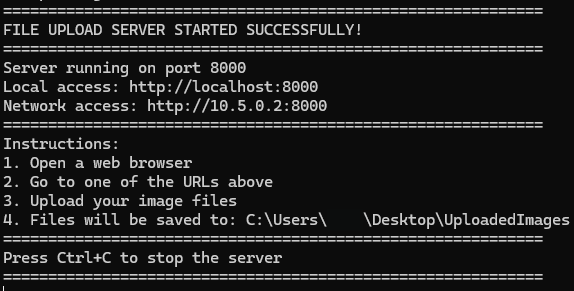

# Image Upload Server

A simple Python HTTP server for uploading and converting images to PNG format.
## Screenshots

### Server Dialog


### Image Upload Dialog


## Features

- Web-based file upload interface
- Automatic conversion of uploaded images to PNG
- Support for multiple file uploads
- Cross-platform compatibility
- Network accessible (other devices on your network can use it)

## Requirements

- Python 3.6+
- Pillow (PIL) library

## Installation

1. Install required dependencies:
```bash
pip install Pillow
```

2. Download or clone this repository

## Usage

### Method 1: Double-click to run
- Simply double-click `UploadFiles.py` to start the server

### Method 2: Command line
```bash
python UploadFiles.py
```

The server will start and display:
- Local URL: `http://localhost:8000`
- Network URL: `http://YOUR_IP:8000`

## How it works

1. Start the server
2. Open a web browser and go to the displayed URL
3. Select image files to upload
4. Files are automatically converted to PNG format
5. Converted files are saved to `~/Desktop/UploadedImages/`

## Supported Image Formats

Any format supported by Pillow/PIL:
- JPEG, PNG, BMP, GIF, TIFF, WEBP, and more

## License

This project is open source and available under the MIT License.
